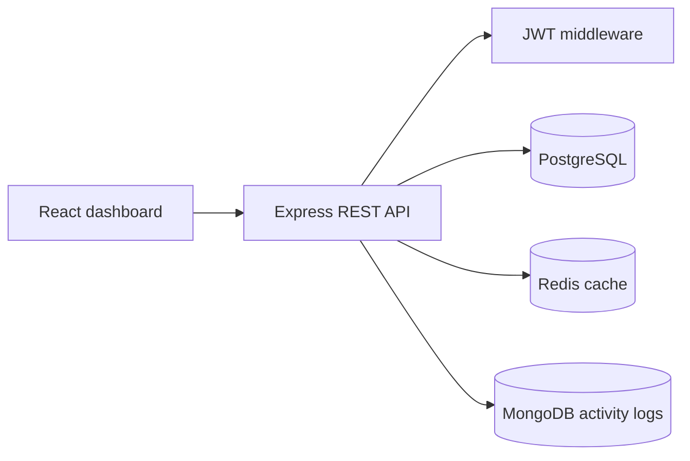

# Parking Lot System Design Document

## Problem and assumptions

The system manages a fixed lot with 5 bike bays, 5 car bays, and 2 truck bays. A vehicle may have one active record at a time. A bay is compatible only with its vehicle type. PostgreSQL is authoritative for all state that affects whether a vehicle may enter or leave. Timestamps are stored as UTC. Duration is rounded up to whole minutes for billing.

## High-level design

React handles presentation and sends JSON requests. Express validates requests and applies business rules. PostgreSQL stores slots and parking records. Redis caches the frequently-read availability counts for 30 seconds and is invalidated after every successful entry or exit. MongoDB stores append-only audit events and is not used to make parking decisions.

## PostgreSQL schema

`parking_slots` contains the unique bay number, compatible vehicle type, availability status, and timestamps. `parking_records` contains the unique ticket, normalized vehicle number, vehicle type, slot foreign key, entry and exit timestamps, duration, fare, and active/completed status. Partial unique indexes prevent more than one active record for a vehicle or slot. `app_users` stores usernames and bcrypt password hashes for the basic operator login.

Seed data creates B1-B5, C1-C5, T1-T2 and the development operator `admin` with password `change-me-now`. Production deployments must replace this seed and use a strong secret.

## API contract

- `POST /api/auth/login`: accepts `{ username, password }`; returns a JWT.
- `POST /api/parking/park`: authenticated; accepts `{ vehicleNumber, vehicleType }`; returns the generated ticket and entry details, or HTTP 409 `PARKING_FULL`.
- `POST /api/parking/exit`: authenticated; accepts `{ ticketId }` or `{ vehicleNumber }`; returns exit details, duration, and fare.
- `GET /api/parking/slots`: authenticated; returns totals and available counts.
- `GET /api/parking/active?page=1&limit=25`: authenticated; returns active records and pagination metadata.
- `GET /api/parking/history?page=1&limit=25`: authenticated; returns completed records and pagination metadata.
- `GET /api/health`: public process health check.

Errors use `{ success: false, message, errorCode }` and never expose SQL, stack traces, or credentials.

## Concurrency strategy

Parking uses one PostgreSQL transaction:

1. Begin a transaction.
2. Check the normalized vehicle against active records.
3. Select one compatible available slot using `SELECT ... FOR UPDATE SKIP LOCKED`.
4. Mark that slot occupied.
5. Insert the active ticket.
6. Commit.

When two requests compete for the last compatible bay, PostgreSQL locks the row selected by the first transaction. The second request skips the locked row and sees no available bay. It receives `Parking Full`. Partial unique indexes provide additional protection against duplicate active vehicles and slots. Redis is never used as the concurrency authority.

Exit also locks the active record, calculates the fare on the server, completes the record, and releases the slot in one transaction.

## Fare rules

- 0-180 minutes: Rs 30
- 181-360 minutes: Rs 85
- More than 360 minutes: Rs 120

The fare service is reusable and tested at all boundaries. The client only displays the server result.

## Security and reliability

Helmet, CORS, JSON size limits, backend validation, bcrypt password hashing, JWT expiry, environment-based secrets, and write rate limiting are enabled. SQL parameters are always bound values. Redis and MongoDB failures are logged without changing PostgreSQL state. List endpoints are paginated and indexed for growth.

For 100x traffic, run multiple stateless API instances behind a load balancer, keep JWT validation local, use a PostgreSQL connection pool and read replicas for reporting endpoints, keep the primary for parking transactions, and move audit processing to a queue. Redis can absorb hot availability reads with short expiry.

## Trade-offs and future work

This two-day implementation has one operator role, no vehicle-owner accounts, and best-effort audit logging. A production version would add role-based access, refresh tokens, structured logging and metrics, a durable event queue, database migrations, and a dedicated integration-test database.

## Test and demo plan

Run `npm test` in `server` for the API and fare tests. With PostgreSQL, MongoDB, and Redis services running, use PowerShell `$env:RUN_INTEGRATION='1'; npm test`. The concurrency test fills all but one currently available car bay using temporary records, sends two simultaneous requests, and cleans up only its temporary records while asserting exactly one success and one `PARKING_FULL` response.

## Deployment and submission notes

Run the three data services with `docker compose up -d`, copy `server/.env.example` to `server/.env`, and start the API and client locally. Existing PostgreSQL volumes created before the authentication table was introduced must receive `database/migration-auth.sql` once. The repository must exclude `server/.env`, generated dependencies, and frontend build output. `server/.env.example` is safe to submit because it contains placeholders only. The seeded bcrypt hash and development login are demo-only values, not production credentials.
